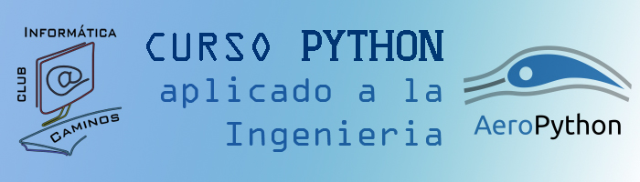

# Curso AeroPython. (ETSI Caminos, Canales y Puertos).

## Contenido:

Curso de iniciación a Python aplicado a la Ingeniería destinado a alumnos de ETSI Caminos, Canales y Puertos (UPM).

__Si acabas de llegar__, no tienes instalado Python o no conoces Jupyter Notebook, te recomendamos que leas esta [introducción](http://nbviewer.ipython.org/github/AeroPython/curso_caminos-2016/blob/master/notebooks_completos/Clase0_Bienvenido.ipynb). En ella aprenderás cómo descargar y utilizar el material del curso.

__Si sólo quieres echar un vistazo__, puedes visualizar los notebooks de cada clase [aquí](http://nbviewer.ipython.org/github/AeroPython/curso_caminos-2016/tree/master/notebooks_completos/).

## Edición actual: Noviembre 2016.

https://caminosinformatica.com/producto/curso-python/

Equipo:

* [Álex Sáez](https://github.com/AlexS12)
* [Jose Luis Cercós](https://github.com/sanguinariojoe)
* [Juan Luis Cano](https://github.com/Juanlu001)
* [Siro Moreno](https://github.com/AunSiro)
* [Mabel Delgado](https://github.com/mabeldb)
* Martín Collado (sistemas/infraestructura)
* José Luis Orts (sistemas/infraestructura)

## Ediciones previas: 

* Febrero/Marzo 2016.

    * [Juan Luis Cano](https://github.com/Juanlu001)
    * [Álex Sáez](https://github.com/AlexS12)
    * [Juan José Matesanz](https://github.com/JuanMatSa)

## Cursos similares:

__[Primera edición UC3M](http://pybonacci.org/2015/09/17/curso-aeropython-en-la-uc3m/):__ octubre 2015

__[Última edición ETSI Aeronáticos](https://github.com/AeroPython/Curso_AeroPython/tree/master/notebooks_completos):__ abril 2015. 

 Curso AeroPython por Juan Luis Cano Rodriguez y Alejandro Sáez Mollejo se distribuye bajo una <a rel="license" href="http://creativecommons.org/licenses/by/4.0/deed.es">Licencia Creative Commons Atribución 4.0 Internacional</a>.
